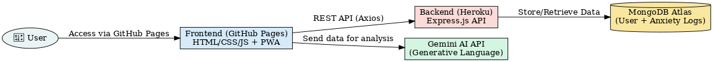

# 🦆 Anxiety Tap Game - Backend

Anxiety Tap Game is a calming, interactive mental health app designed to help users relieve anxiety through mindful tapping. Each tap triggers gentle feedback (sound + animation), logs data for analysis, and visualizes patterns over time. Built as a responsive **Progressive Web App (PWA)** with backend analytics support.

> 🔗 **Related Repositories**:
>
> -   🌐 [Frontend Repo](https://github.com/hogan-tech/StevensQuakHackthonFE)
> -   🧠 [Backend Repo](https://github.com/hogan-tech/StevensQuakHackthon)
> -   🌍 [GitHub Pages (Static Deployment)](https://github.com/hogan-tech/hogan-tech.github.io)

---

## ✨ Features

-   👤 **User Registration & Login**  
    Securely register and authenticate users using hashed passwords.

-   📈 **Anxiety Event Tracking**  
    Users can log anxiety events with timestamps categorized by day and time.

-   🧠 **Anxiety Count Management**  
    Automatically counts and stores anxiety event frequencies for users.

-   🌐 **REST API**  
    Lightweight and scalable Express.js API.

-   🌍 **Deployment**
    The backend is deployed on **Heroku** and can be accessed here:  
    🔗 [https://desolate-tor-24628-0ba2463868a2.herokuapp.com/](https://desolate-tor-24628-0ba2463868a2.herokuapp.com/)

---

## 📁 Project Structure

```
backend/
├── app.js                  # Entry point of the Express app
├── package.json            # Project dependencies and scripts
├── routes/                 # Express route handlers
│   ├── index.js            # Route mapping
│   ├── users.js            # User auth routes
│   └── anxiety.js          # Anxiety tracking routes
├── data/                   # Data access layer
│   ├── index.js            # Central export for all data modules
│   ├── users.js            # User-related DB operations
│   └── anxiety.js          # Anxiety tracking DB operations
└── config/
    └── mongoCollections.js # (Assumed) MongoDB collection helpers
```

---

## 🚀 Getting Started

### Prerequisites

-   Node.js (v18+ recommended)
-   MongoDB running locally or via Atlas

### Installation

```bash
git clone https://github.com/hogan-tech/StevensQuakHackthon.git
cd backend
npm install
```

### Running the Server

```bash
npm start
```

By default, the server runs on **http://localhost:3000**

---

## 📦 API Endpoints

### 🧍‍♂️ Users

#### `POST /users/register`

Registers a new user.

**Body:**

```json
{
    "userName": "john_doe",
    "password": "secure123"
}
```

**Response:**

```json
{
    "message": "User registered",
    "user": {
        "_id": "some-id",
        "userName": "john_doe"
    }
}
```

---

#### `POST /users/login`

Authenticates a user.

**Body:**

```json
{
    "userName": "john_doe",
    "password": "secure123"
}
```

**Response:**

```json
{
    "_id": "some-id",
    "userName": "john_doe"
}
```

---

### 📊 Anxiety

#### `POST /anxiety`

Logs an anxiety event for a specific user on a specific day and time.

**Body:**

```json
{
    "userName": "john_doe",
    "day": "2025-03-29",
    "time": "14:00"
}
```

**Response:**

```json
{
    "message": "Anxiety updated",
    "timestamp": "3/29/2025, 2:05:00 PM",
    "totalCount": 5
}
```

#### `Get /anxiety/today`

Fetch today's anxiety data for a specific user.

**Query Parameters:**

-   `userName` (string) – the username to retrieve data for (required)
-   `day` (string, format: YYYY-MM-DD) – the date to retrieve data for (required)

**Response:**

```json
{
    "day": "2025-03-29",
    "count": 4,
    "time": ["09:21", "09:21", "09:22", "14:48"]
}
```

#### `GET /anxiety/sevenDays`

Fetch previous seven days' anxiety data for a specific user.

**Query Parameters:**

-   `userName` (string) – the username to retrieve data for (required)
-   `day` (string, format: YYYY-MM-DD) – the end date to retrieve data for (required)

**Response:**

```json
[
    {
        "day": "2025-03-29",
        "count": 4,
        "time": ["09:21", "09:21", "09:22", "14:48"]
    },
    {
        "day": "2025-03-28",
        "count": 6,
        "time": ["08:12", "10:45", "13:00", "14:10", "18:30", "20:15"]
    },
]
```

---

## ⚙️ Technologies Used

-   **Node.js** – JavaScript runtime
-   **Express.js** – Web server framework
-   **MongoDB** – NoSQL database
-   **bcrypt** – Secure password hashing
-   **cool-ascii-faces** – Fun ASCII art (for optional routes)

---

## 🛡️ Error Handling

Each route validates the input and responds with appropriate HTTP status codes and JSON-formatted error messages.

---

## 🌐 Architecture Overview

```plaintext
User 👤
   |
   | 1️⃣ Access PWA via GitHub Pages
   ▼
Frontend (Static SPA)
📍 GitHub Pages (https://hogan-tech.github.io)

   • Built with HTML/CSS/JavaScript (Vanilla + Tailwind)
   • Registers/Login users (via backend API)
   • Tapping interaction: plays sound, animates duck, sends event
   • PWA features: manifest + service worker for offline support
   • Calls Gemini AI for emotional analysis & guidance
   • Fetches daily/weekly stats (chart.html)

   |
   | REST API calls (Axios)
   ▼
Backend Server (Express.js)
📍 Heroku (https://desolate-tor-24628-0ba2463868a2.herokuapp.com)

   • `/users/register` and `/users/login`
   • `/anxiety` logs tap events (timestamped)
   • `/anxiety/today` and `/anxiety/sevenDays` return stats
   • Responses formatted in JSON
   |
   ▼
Database (MongoDB Atlas)
📍 Cloud MongoDB (Remote Cluster)

   • Stores:
     - 🧍 User data (username + hashed password)
     - 🧠 Anxiety event logs (user, day, time)
   • Indexed for date/time performance
```

---

## 🤖 Gemini AI (LLM API)

```
Frontend JavaScript
  └── sends anxiety history to Gemini via fetch()
        ↳ Google Generative Language API (Gemini 2.0 Flash)
              • Returns AI-generated wellness analysis
              • Provides advice, emotional patterns, or praise
```

- Triggered on `chart.html` load or user message input
- Personalized text displayed in `#geminiOutput`

---

## 📊 Data Flow Example

```
[User taps duck] → index.js
  → POST /anxiety
  → MongoDB saves { user, day, time }

[chart.html loads] → fetch /sevenDays or /today
  → fetch data
  → call Gemini API
  → render chart + response
```

---

## 📦 Deployment Overview

| Component     | Platform               | URL / Access                                   |
|---------------|------------------------|------------------------------------------------|
| **Frontend**  | GitHub Pages           | https://hogan-tech.github.io                   |
| **Backend**   | Heroku                 | https://desolate-tor-24628-0ba2463868a2.herokuapp.com |
| **Database**  | MongoDB Atlas          | Secure Cloud Cluster                           |
| **AI Service**| Google Gemini API      | `gemini-2.0-flash` via `fetch()`               |

---

## 🗺️ Diagram



---

## ✨ Notes

- The system supports both real-time interaction (tapping) and delayed analytics (charts + AI)
- It is fully mobile-ready, installable as a PWA, and uses caching for offline access
- Gemini API provides empathetic support based on the user’s stress patterns

---

## 🧪 Future Improvements

-   JWT-based authentication
-   Frontend integration
-   Daily/weekly analytics summaries
-   Rate limiting and security middleware

---

## 📝 License

This project is licensed under the ISC License – see the [LICENSE](./LICENSE) file for details.

---

## 👤 Author

-   Hogan, Lin: GitHub: [@hogan-tech](https://github.com/hogan-tech)
-   Gaoyi, Wu: GitHub: [@Alfred768](https://github.com/Alfred768)
-   Wei Ting, Kuo: GitHub: [@kuowesley](https://github.com/kuowesley)
-   Yu-An, Liao: GitHub: [@PeterLikeEat](https://github.com/PeterLikeEat)
